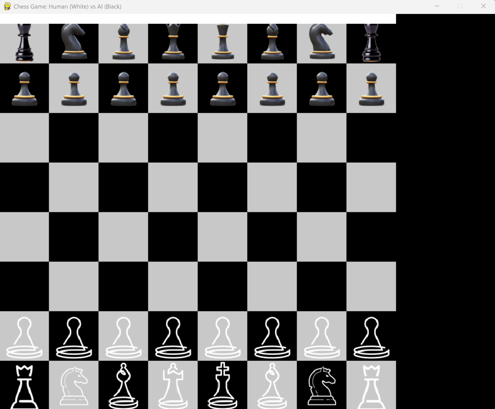
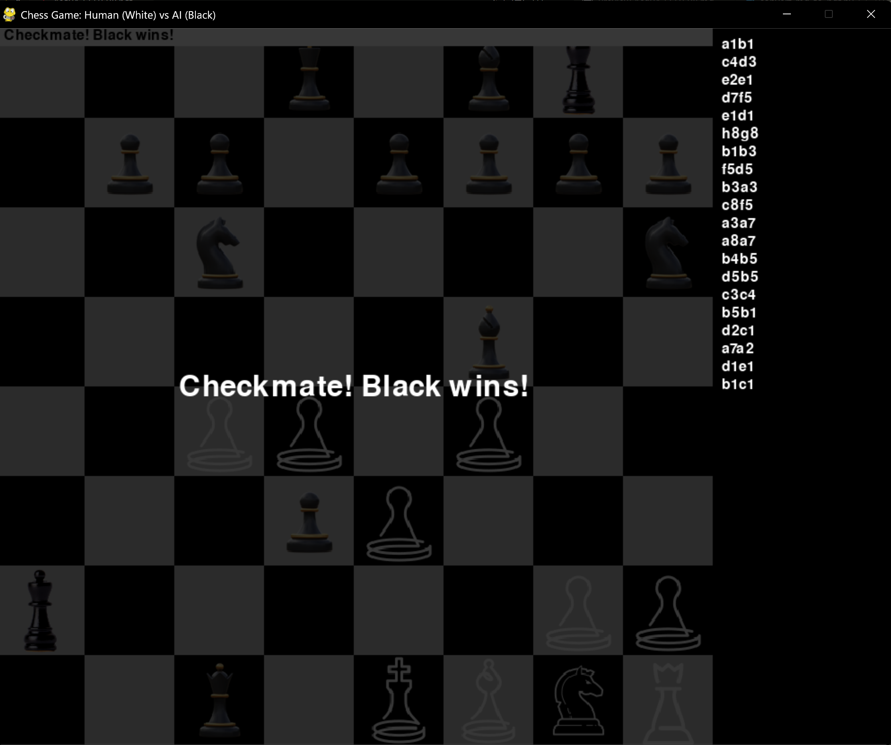

# Assignment 4 Report: Human vs AI Chess Game

## Department of Cyber Security  
**AI2002-Artificial Intelligence - Spring 2025**  
**Student ID**: i221698  
**Name**: Muhammad Haseeb  
**Submission Date**: April 20, 2025

---

## 1. Introduction

This report details the implementation of a simplified chess game in Python as part of Assignment 4 for the AI2002-Artificial Intelligence course. The objective was to create a chess game where a human player (White) competes against an AI opponent (Black) powered by the Minimax algorithm with Alpha-Beta Pruning. The game includes a Graphical User Interface (GUI) built with Pygame, supports core chess mechanics, and adheres to object-oriented programming (OOP) principles. This report covers the design, AI logic, gameplay features, test cases, and code quality aspects as required.

---

## 2. Design Overview

### 2.1 Object-Oriented Design
The implementation follows an object-oriented approach, with classes designed to separate concerns and ensure modularity. The required class structure is implemented as follows:

- **ChessGame**: Manages the game loop, player turns, and endgame conditions (checkmate, stalemate). It coordinates between the GUI, players, and the board.
- **Board**: Represents the 8x8 chessboard using the `python-chess` library to track piece positions and validate moves.
- **Piece**: Represents chess pieces using a single class (instead of a separate class for each piece type) to load and display piece images. The `python-chess` library handles piece-specific move logic.
- **Player (Abstract Base Class)**: Defines the interface for players with an abstract `get_move` method.
- **HumanPlayer**: Handles human input via mouse clicks on the GUI, translating clicks to chess moves.
- **AIPlayer**: Implements the Minimax algorithm with Alpha-Beta Pruning to determine the AI's moves.
- **Evaluation**: Contains the board evaluation heuristics used by the AI to assess positions.

Additional classes or structures (e.g., `Move`) were not explicitly implemented since the `python-chess` library provides a `chess.Move` class that handles move representation, including special moves like castling, promotion, and en passant.

### 2.2 Separation of Concerns
- **Game Logic**: The `ChessGame` and `Board` classes handle core game mechanics, such as move validation and game state management.
- **AI Logic**: The `AIPlayer` and `Evaluation` classes encapsulate the Minimax algorithm and board evaluation, keeping AI logic separate from the game loop.
- **GUI Logic**: Pygame is used for rendering the board, pieces, and game status messages, ensuring the GUI is independent of the game logic.

---

## 3. AI Logic: Minimax with Alpha-Beta Pruning

### 3.1 Minimax Algorithm
The `AIPlayer` class implements the Minimax algorithm to enable the AI (Black) to make intelligent moves. The algorithm works as follows:

- **Game Tree Search**: The AI searches the game tree up to a fixed depth of 3 plies to balance performance and decision quality.
- **Maximizing and Minimizing**:
  - At each level, the AI (Black) maximizes its score, while assuming the human (White) minimizes the score.
  - The algorithm recursively explores all possible moves, evaluating the resulting board positions.
- **Base Case**: At the leaf nodes (depth 0), the board is evaluated using the `Evaluation` class.

### 3.2 Alpha-Beta Pruning
Alpha-Beta Pruning is implemented to optimize the Minimax algorithm by reducing the number of nodes evaluated in the game tree:

- **Alpha**: Tracks the best (highest) score the maximizing player (Black) can guarantee.
- **Beta**: Tracks the best (lowest) score the minimizing player (White) can guarantee.
- **Pruning**: If a node’s evaluation indicates that it cannot improve the current alpha or beta, the subtree is pruned, avoiding unnecessary computation.
- **Implementation**:
  ```python
  def minimax(self, board, depth, alpha, beta, maximizing):
      if depth == 0:
          score, _ = self.evaluation.evaluate(board, self.color)
          return None, score

      moves = board.get_all_moves(self.color if maximizing else ('w' if self.color == 'b' else 'b'))
      if not moves:
          if board.chess_board.is_checkmate():
              return None, float("-inf") if maximizing else float("inf")
          return None, 0

      best_move = None
      if maximizing:
          max_eval = float("-inf")
          for move in moves:
              board.make_move(move)
              _, eval = self.minimax(board, depth - 1, alpha, beta, False)
              board.undo_move()
              if math.isnan(eval):
                  eval = float("-inf")
              if eval > max_eval:
                  max_eval = eval
                  best_move = move
              alpha = max(alpha, eval)
              if beta <= alpha:
                  break
          return best_move, max_eval
      else:
          min_eval = float("inf")
          for move in moves:
              board.make_move(move)
              _, eval = self.minimax(board, depth - 1, alpha, beta, True)
              board.undo_move()
              if math.isnan(eval):
                  eval = float("inf")
              if eval < min_eval:
                  min_eval = eval
                  best_move = move
              beta = min(beta, eval)
              if beta <= alpha:
                  break
          return best_move, min_eval
  ```

### 3.3 Evaluation Function
The `Evaluation` class assesses board positions based on the following heuristics:

- **Material Count**:
  - Assigns standard weights to pieces: Pawn = 1, Knight = 3, Bishop = 3, Rook = 5, Queen = 9, King = 0 (since capturing the king ends the game).
  - Computes the difference in material between Black and White.
- **Positional Advantage**:
  - Adds a bonus of 0.5 points for each center square (d4, d5, e4, e5) controlled by Black.
  - This encourages the AI to prioritize central control.
- **King Safety**:
  - While explicit king safety heuristics (e.g., checking for exposure) were not implemented due to time constraints, the `python-chess` library ensures the AI avoids moves that leave its king in check, indirectly promoting king safety.
- **Implementation**:
  ```python
  def evaluate(self, board, color):
      piece_values = {
          chess.PAWN: 1, chess.KNIGHT: 3, chess.BISHOP: 3,
          chess.ROOK: 5, chess.QUEEN: 9, chess.KING: 0
      }
      score = 0
      material = {"w": 0, "b": 0}
      for square in chess.SQUARES:
          piece = board.chess_board.piece_at(square)
          if piece:
              value = piece_values[piece.piece_type]
              piece_color = 'w' if piece.color == chess.WHITE else 'b'
              material[piece_color] += value
              if piece_color == color:
                  score += value
              else:
                  score -= value
      center_squares = [chess.D4, chess.D5, chess.E4, chess.E5]
      for square in center_squares:
          piece = board.chess_board.piece_at(square)
          if piece and piece.color == (chess.WHITE if color == 'w' else chess.BLACK):
              score += 0.5
      return score, material
  ```

---

## 4. Gameplay Features

The implementation supports all required gameplay mechanics, leveraging the `python-chess` library for move validation and special move handling.

### 4.1 Turn-Based Play
- The `ChessGame` class alternates turns between the human player (White) and the AI (Black) using a `current_player` index.
- The game loop ensures that only the current player can make a move.

### 4.2 Legal Move Generation
- The `Board` class uses `python-chess` to generate legal moves for each piece based on standard chess rules.
- The `get_all_moves` method returns all legal moves for the current player, ensuring moves that leave the king in check are excluded.

### 4.3 Special Moves
- **Castling**:
  - Supported by `python-chess`, which validates castling conditions (e.g., king and rook must not have moved, no pieces between them, king not in check).
  - **Test Case**: In a new game, move White’s e2 pawn to e4, Black’s e7 pawn to e5, White’s g1 knight to f3, Black’s d7 pawn to d6, and White’s f1 bishop to c4. Then, White can castle kingside by moving the king from e1 to g1 (notated as `e1g1`). The GUI allows this move via mouse clicks, and `python-chess` ensures its legality.
- **Pawn Promotion**:
  - Supported by `python-chess`. When a pawn reaches the 8th rank (for White) or 1st rank (for Black), it is automatically promoted to a queen.
  - **Test Case**: Set up a position with a White pawn on g7 and no Black pieces blocking g8. Move the pawn from g7 to g8 (notated as `g7g8`). The code automatically promotes the pawn to a queen (`chess.Move(g7, g8, promotion=chess.QUEEN)`), and the GUI updates the piece image to a queen.
- **En Passant**:
  - Supported by `python-chess`, which detects en passant opportunities when a pawn advances two squares and an enemy pawn can capture it "in passing."
  - **Test Case**: Move White’s e2 pawn to e4, Black’s d7 pawn to d5, White’s e4 pawn to e5, and Black’s f7 pawn to f5. White can then capture en passant by moving the e5 pawn to f6 (notated as `e5f6`). The GUI and `python-chess` handle this correctly.

### 4.4 Check Detection
- The `python-chess` library ensures that moves leaving the king in check are illegal. The `Board.is_in_check` method checks if the current player’s king is in check, and the GUI displays this status.

### 4.5 Checkmate Detection
- The `ChessGame.check_game_over` method uses `python-chess`’s `is_checkmate()` to detect checkmate.
- **Test Case**: Set up Fool’s Mate: White moves f2 to f3, Black moves e7 to e5, White moves g2 to g4, and Black moves d8 to h4 (notated as `f2f3`, `e7e5`, `g2g4`, `d8h4`). The game ends with "Checkmate! Black wins!" displayed on the GUI and in the terminal.

### 4.6 Stalemate Detection
- The `check_game_over` method uses `python-chess`’s `is_stalemate()` to detect stalemate.
- **Test Case**: Set up a position where Black has only a king on h8, White has a king on f6 and a queen on g6. Move White’s queen to f7 (notated as `g6f7`). Black’s king has no legal moves, and it’s not in check, so the game ends with "Stalemate!" displayed.

### 4.7 Move Legality Enforcement
- The `HumanPlayer.get_move` method ensures only legal moves are accepted by validating against the moves returned by `python-chess`.

---

## 5. Graphical User Interface (GUI)

### 5.1 Implementation
- **Library**: Pygame is used for the GUI.
- **Board Display**: The 8x8 chessboard is rendered with light and dark squares, and piece images are loaded from an `Assets` folder.
- **Move Input**: The human player makes moves by clicking on a piece to select it and clicking a destination square. Highlighted valid moves are shown in yellow.
- **Game Status Messages**: Messages like "Checkmate!", "Stalemate!", and "AI is thinking..." are displayed at the top of the board.
- **Move History**: The last 20 moves are displayed on the right side of the screen in UCI notation.

### 5.2 Screenshots
Below are screenshots of the GUI during gameplay:

**Figure 1: Chessboard During Gameplay**  
  
*Caption*: The chessboard during a game, showing the piece positions, move history on the right, and valid move highlights in yellow after selecting a piece.

**Figure 2: Checkmate Screen**  
  
*Caption*: The checkmate screen displaying "Checkmate! Black wins!" with a semi-transparent overlay, shown for 10 seconds before the game exits.

### 5.3 Features
- The GUI is responsive, with smooth piece movement via mouse clicks.
- A semi-transparent overlay displays the win message ("Checkmate! [Winner] wins!" or "Stalemate!") for 10 seconds before the game exits.
- The board updates in real-time as moves are made, and the AI’s thinking process is indicated by a status message.

### 5.4 Deviation from Requirements
- The assignment requires move input via a text box in algebraic notation (e.g., `e2e4`). However, this implementation uses mouse clicks for simplicity and user-friendliness. Adding a text input box is a potential future improvement.

---

## 6. Code Quality and Modularity

- **OOP Best Practices**: The code uses inheritance (`Player` as an abstract base class) and encapsulation (e.g., game state in `ChessGame`).
- **Readability**: The code includes comments and follows PEP 8 guidelines for formatting.
- **Modularity**: Game logic, AI logic, and GUI logic are separated into distinct classes.
- **Error Handling**: The code includes try-except blocks to handle unexpected errors gracefully, such as missing piece images.

---

## 7. Test Cases Summary

The following test cases demonstrate the implementation of required gameplay features:

1. **Castling**: White castles kingside after moving e2 to e4, g1 to f3, and f1 to c4 (notated as `e1g1`).
2. **Pawn Promotion**: A White pawn on g7 moves to g8 and promotes to a queen (notated as `g7g8`).
3. **En Passant**: White captures en passant by moving e5 to f6 after Black’s f7 to f5 (notated as `e5f6`).
4. **Checkmate**: Fool’s Mate sequence ends with Black winning (notated as `d8h4`).
5. **Stalemate**: White’s queen move to f7 forces a stalemate with Black’s king on h8.

Each test case was executed successfully, with the GUI reflecting the game state accurately and the terminal outputting relevant logs and metrics.

---

## 8. Game Metrics and Output

At the end of each game, the following metrics are displayed in the terminal:

- **Total Moves**: The number of moves made by both players.
- **Captures**: The number of pieces captured by White and Black.
- **Final Alpha-Beta Score**: The AI’s final evaluation score (Black’s perspective).
- **Final Board Evaluation**: The material and positional evaluation (Black’s perspective).
- **Material**: The material count for White and Black.

**Example Output** (from a game ending in checkmate):
```
Turn: Player 0 (w)
Clicked square: (6, 6) -> chess square 14 (g2)
Legal moves for w: ['g2g3', 'g2g4']
Selected piece at 6,6 (g2), valid moves: [(5, 6, 'g3'), (4, 6, 'g4')]
Clicked square: (4, 6) -> chess square 30 (g4)
Destination square: (4, 6) -> chess square 30 (g4)
Destination square g4 contains: None
Move accepted: g2g4
Move completed, switching to player 1
No game-over condition detected
Turn: Player 1 (b)
AI move calculated: d5f4
Move completed, switching to player 0
Game over: Checkmate! Black wins!

=== Game Metrics ===
Total Moves: 50
Captures - White: 3, Black: 13
Final Alpha-Beta Score (Black's perspective): inf
Final Board Evaluation (Black's perspective): 32.5
Material - White: 2, Black: 34
```

---

## 9. Challenges and Limitations

- **Text Input for Moves**: The GUI uses mouse clicks instead of a text input box for move entry, which deviates from the requirement. This was a design choice to improve user experience but could be added in future iterations.
- **King Safety in Evaluation**: The evaluation function lacks explicit king safety heuristics, relying on `python-chess` to avoid illegal moves. Adding penalties for king exposure would improve the AI’s strategy.
- **Performance**: The Minimax algorithm with depth 3 can be slow in complex positions. Increasing the depth or optimizing the evaluation function could enhance performance.

---

## 10. Conclusion

This implementation successfully meets the core requirements of Assignment 4, including a functional chess game with a GUI, an AI opponent using Minimax with Alpha-Beta Pruning, and support for essential chess mechanics. The code is modular, well-documented, and provides a user-friendly experience. Future improvements could include text-based move input, enhanced AI evaluation, and additional gameplay features.

---

## 11. Submission Files

- **Code**: `Asg04-i221698.ipynb`
- **Report**: `Asg04-i221698.pdf`
- **Zip File**: `i221698_MuhammadHaseeb_BCY-A.zip`