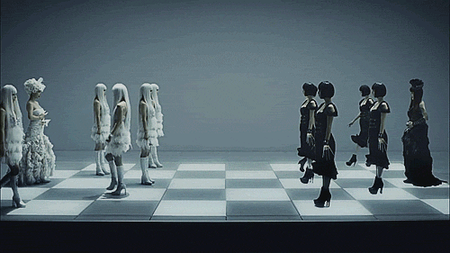

  

<h1 align="center">♟️ Chess Game Assignment 4 ♟️</h1>

  <strong>A Human vs AI Chess Game implemented in Python using the Minimax algorithm with Alpha-Beta Pruning</strong> 
  <em>Submission for AI2002 - Artificial Intelligence, Spring 2025</em>

  
  
  

---

### 📋 Project Overview

This repository contains my submission for **AI2002 Assignment 4** - a chess game where a human player (White) competes against an AI opponent (Black). The AI uses the **Minimax algorithm with Alpha-Beta Pruning** for intelligent move selection, and the game features a **Graphical User Interface (GUI)** built with Pygame. The implementation supports core chess mechanics, including castling, pawn promotion, and en passant.

---

### 📜 Detailed Report

For the full report, including **screenshots**, **code snippets**, and **test cases**, check out:  
👉 **[Assignment 4 Report](Asg04-i221698.md)**

Want to view the report in PDF format?  
📄 **[Download the PDF Version](Asg04-i221698.pdf)**

---

### 🛠️ Other Files

- 🐍 **[Conversion Script](convert_md_to_pdf.py)**: Python script to convert the markdown report to PDF.
- 📓 **[Jupyter Notebook](Asg04-i221698.ipynb)**: Code implementation of the chess game.
- 📦 **[Zip Submission](i221698_MuhammadHaseeb_BCY-A.zip)**: Zipped submission file.

---

### 🎥 Preview

  

---

  <em>Built with 💻 and ☕ by Muhammad Haseeb (i221698)</em>

